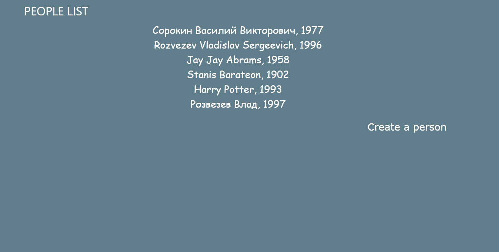
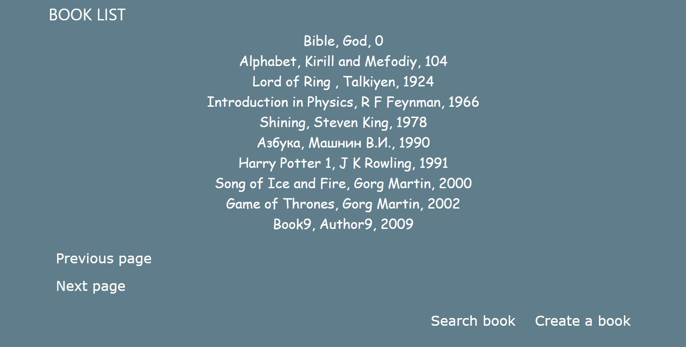

# Library app

<b>Приложение для учёта книг в библиотеке.</b>
    
-Возможности: 
      
-Регистрировать людей в БД
 
      
-Добавлять и убирать книги на их имя
 
      
-Смотреть просрочена ли книга у пользователя библиотеки

    

     
    
-Конфигурация:war-file, database PostgreSQL, JPA provider - Hibernate.

     
    -Можно выдать пользователю роль ADMIN, тогда у него появится возможность перейти на страницу /admin, где видно всех зарегистрированных пользователей.
     
     
    
<b>Скриншоты страниц: </b>

    
Страница регистрации пользователей

    
    
Страница всех книг в библиотеке

    
    
Страница поиска книг

    

